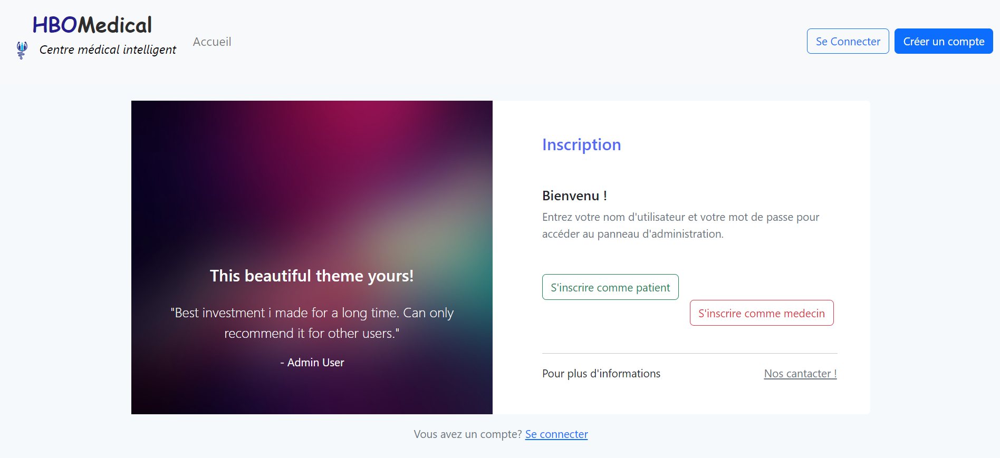
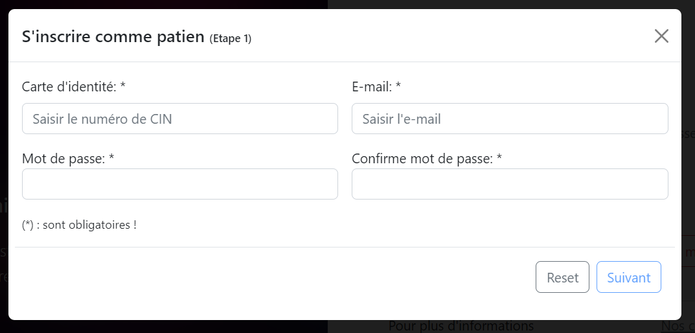
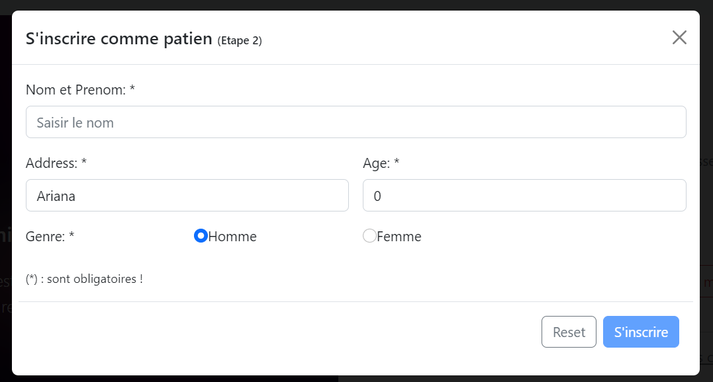
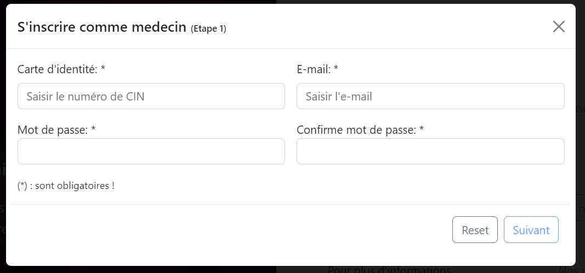
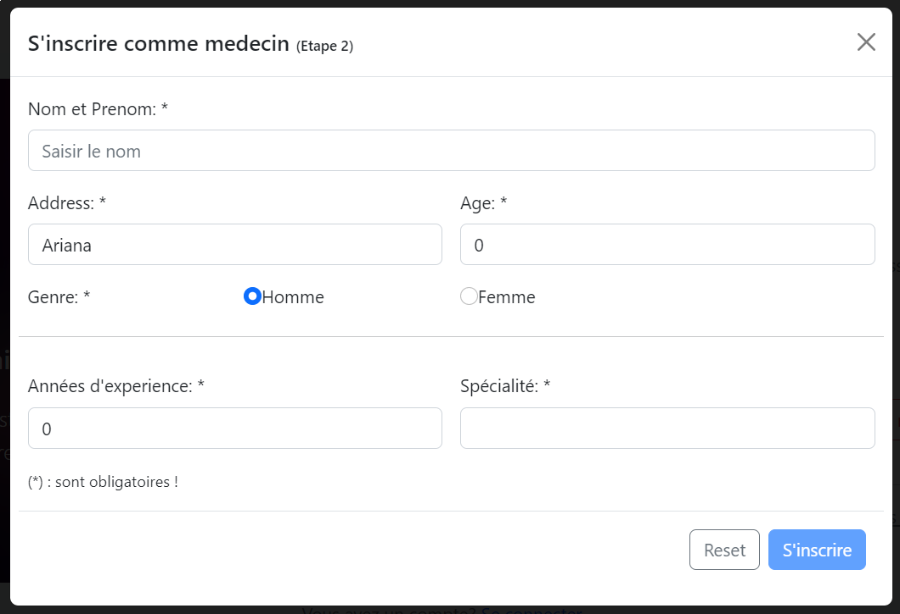
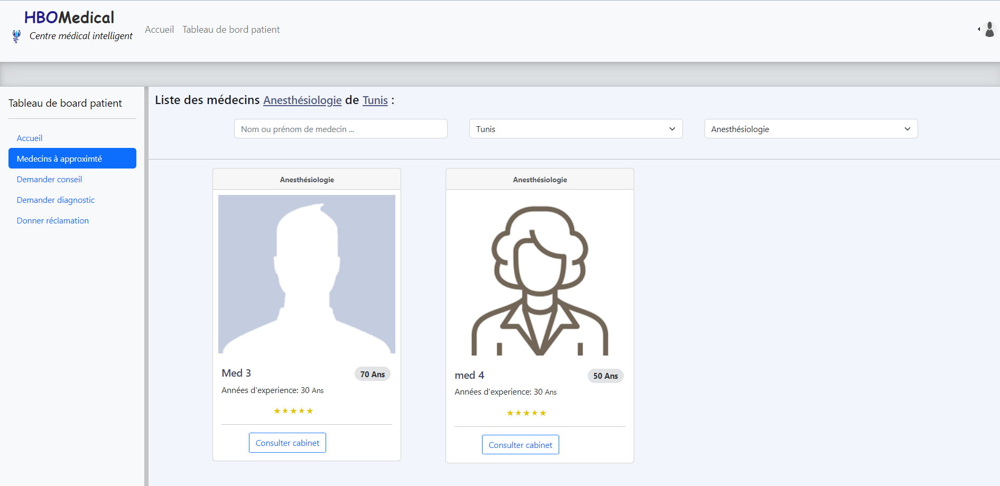
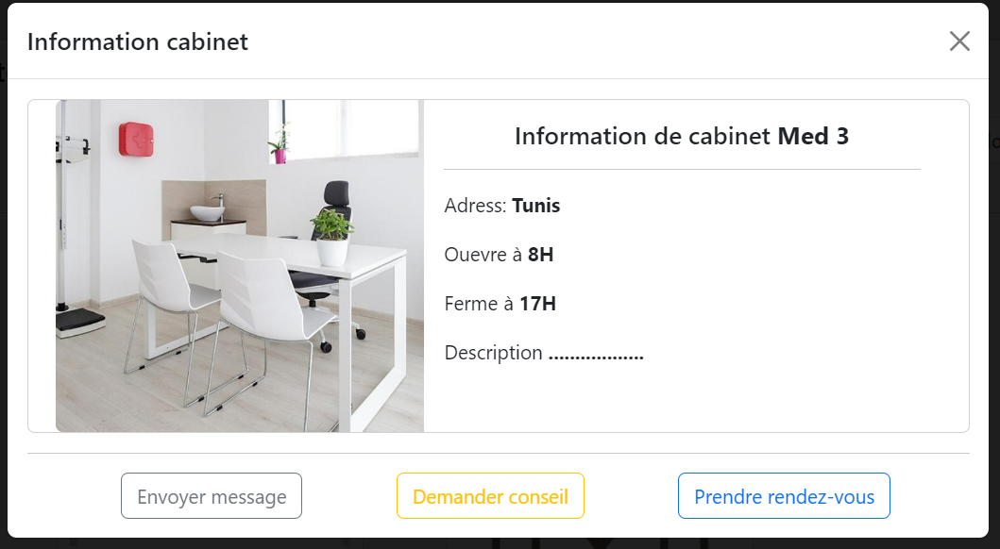

# Smart_Medical_Center_ENSI
# PCD_ENSI_Tabaa_Weldek

This project is a demo of a web application (Subject: Smart medical Center)
that uses:
  -Angular 15 on the front-end.
  -Spring Boot on the back-end.
  -Mongo DB on bd.
The application allows users to view, create, and update customer information.

# Use Case
our project has the following features:
  -Management of patient and doctor accounts.
  -As a patient, I can consult the list of doctors nearby.
  -As a patient, I can seek medical advice.
  -As a doctor, I can give my symptoms to have my disease and the possible treatments.

# Frontend

This project was generated with [Angular CLI](https://github.com/angular/angular-cli) version 15.1.3.

## Development server

Run `ng serve` for a dev server. Navigate to `http://localhost:4200/`. The application will automatically reload if you change any of the source files.

## Code scaffolding

Run `ng generate component component-name` to generate a new component. You can also use `ng generate directive|pipe|service|class|guard|interface|enum|module`.

## Build

Run `ng build` to build the project. The build artifacts will be stored in the `dist/` directory.

## Running unit tests

Run `ng test` to execute the unit tests via [Karma](https://karma-runner.github.io).

## Running end-to-end tests

Run `ng e2e` to execute the end-to-end tests via a platform of your choice. To use this command, you need to first add a package that implements end-to-end testing capabilities.

## Further help

To get more help on the Angular CLI use `ng help` or go check out the [Angular CLI Overview and Command Reference](https://angular.io/cli) page.

## Backend

./mvnw spring-boot:run

This will start the Spring Boot server and the application will be accessible at http://localhost:8080.

## BD Mongo DB

Base deployer dans un cluster using MONGO DB ATLAS

##INTERFACES

Accueil Page:

Register Page:

Register Page 'Patient':

Register Page 'Medecin':

Register Page 'Consulter liste des medecins à proximiter':

#Usage
To use the application, navigate to http://localhost:4200 in your web browser. You'll be presented with a list of customers. You can view a customer's details by clicking on their name, or you can create a new customer by clicking the "Create New Customer" button.

To update a customer's details, click the "Edit" button next to their name. You'll be taken to a form where you can edit their information. Click the "Save" button to update the customer's details.

